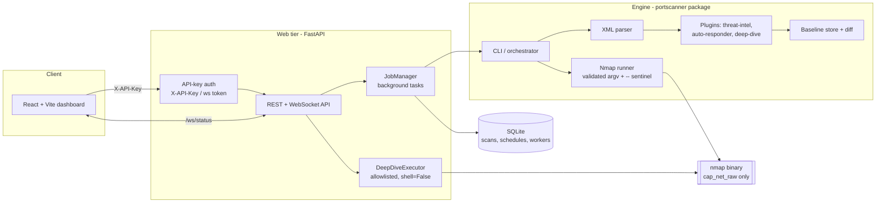

# PortScanner — Network Reconnaissance & Vulnerability Orchestration Platform

[](https://github.com/DipesThapa/PortScanner/actions/workflows/ci.yml)
[](https://github.com/DipesThapa/PortScanner/actions/workflows/codeql.yml)
[](https://www.python.org/)
[](#license)

A security-engineered platform that turns **Nmap** into a full scanning service: a
modular Python engine, a plugin system for threat-intel / automated response /
deep-dive tooling, historical baselining, and an authenticated FastAPI + React
web application for launching and reviewing scans.

> ⚠️ **Authorized use only.** Scan systems you own or have explicit written
> permission to test. See [SECURITY.md](SECURITY.md).

📝 **Write-up:** [*I shipped an unauthenticated RCE in my own port scanner — here's the whole chain, and how I killed it*](https://dev.to/dipesthapa/i-shipped-an-unauthenticated-rce-in-my-own-port-scanner-heres-the-whole-chain-and-how-i-killed-35kl)
(dev.to) · [source](docs/writeup-rce-to-hardened.md)

---

## Why this project

Most "port scanner" projects wrap `nmap` in a subprocess call and stop there.
This one is built like a product a security team could actually deploy:

- **Defense-in-depth by design** — the web tier is authenticated, every scan
  input is validated, command execution is allowlisted, and secrets are redacted
  from logs. The [threat model](#threat-model) is documented, not implied.
- **Extensible engine** — plugins, exporters, credential providers, and a
  distributed-worker abstraction are first-class, not bolted on.
- **Operable** — containerised (non-root), health-checked, CI-tested, and
  scanned by CodeQL, Bandit, and pip-audit on every push.

## Architecture



**Request lifecycle:** the UI submits a scan (`POST /api/scans`) with an API key →
`JobManager` validates input, persists a record, and runs the CLI engine in a
background thread → the engine builds a safe `nmap` argv, parses the XML, runs
plugins, and writes artifacts + baselines → the UI streams status over
`/ws/status` and downloads artifacts on completion.

## Component map

| Layer | Path | Responsibility |
|-------|------|----------------|
| Web API | `webapp/main.py` | Routes, auth wiring, SPA serving |
| Auth | `webapp/security.py` | API-key generation, validation, WS auth |
| Jobs | `webapp/jobs.py` | Scan lifecycle, artifact collection, log redaction |
| Deep-dive | `webapp/deepdive.py` | Allowlisted follow-up command execution |
| Models | `webapp/models.py` | Pydantic request/response + input validation |
| Engine | `portscanner/` | Nmap runner, parser, plugins, baselines, exporters |
| Frontend | `webapp/frontend/` | React + Vite dashboard |

---

## Security model

Full details in [SECURITY.md](SECURITY.md). Highlights:

- **Authentication everywhere.** Every `/api/*` route and the `/ws/status`
  WebSocket require an `X-API-Key`. The key comes from `PORTSCANNER_API_KEY` or is
  generated to `web_runs/.api_key` (mode `0600`) on first boot — the service is
  never anonymous. `GET /api/health` is intentionally open for health checks.
- **Input validation.** Targets, ports, script names, and extra nmap args are
  strictly validated. Flag-like targets and dangerous flags (`--script`, `-oN`,
  `--datadir`, …) are rejected, and a `--` sentinel terminates nmap option
  parsing before the target (defense in depth against argument injection).
- **Command execution is allowlisted** and runs with `shell=False`. Uploaded
  scripts cannot self-authorize; script upload is disabled unless
  `PORTSCANNER_ENABLE_SCRIPT_UPLOAD=1`.
- **Secret hygiene.** Passwords, tokens, bearer headers, and `secret://`
  references are redacted before scan logs are persisted.
- **Hardened container.** Runs as a non-root user; `cap_net_raw` is granted to
  the nmap binary only, so raw scans work without running the service as root.

### Threat model

| # | Threat | Vector | Mitigation |
|---|--------|--------|------------|
| T1 | Unauthenticated access | Exposed API / WebSocket | API-key auth on all `/api` routes + WS; constant-time comparison |
| T2 | Remote command / NSE execution | `--script=…` injected via target/args | Target & arg validation, dangerous-flag denylist, `--` sentinel |
| T3 | Arbitrary code via script upload | `POST /api/plugins/scripts` | Disabled by default; uploads never auto-allowlisted |
| T4 | Command injection in deep-dive | Crafted command strings | Explicit allowlist + `shell=False` + `shlex` tokenisation |
| T5 | Secret leakage | Scan logs persisted to DB | Redaction pass before persistence; `.api_key`/creds gitignored |
| T6 | Privilege escalation | Service running as root | Non-root container; capability scoped to nmap binary |
| T7 | Supply-chain drift | Unpinned deps | Pinned `requirements.txt`; pip-audit + CodeQL in CI |
| T8 | Scan abuse / SSRF-style recon | Unrestricted targets | Auth-gated; deploy behind proxy with source-IP allowlists (see SECURITY.md) |

---

## Quickstart

### Docker (recommended)

```bash
docker compose up --build
# API + UI on http://localhost:8000
# On first boot the generated API key is printed to the logs and stored at web_runs/.api_key
```

Set your own key instead of the generated one:

```bash
PORTSCANNER_API_KEY=$(openssl rand -base64 32) docker compose up --build
```

### Local development

```bash
# Backend
python -m venv .venv && source .venv/bin/activate
pip install -r requirements.txt
export PORTSCANNER_API_KEY=$(openssl rand -base64 32)
uvicorn webapp.main:app --reload    # http://127.0.0.1:8000

# Frontend (separate terminal)
cd webapp/frontend
npm install
npm run dev                          # http://127.0.0.1:5173 (proxies /api to :8000)
```

The UI prompts for the API key on first load and stores it in `localStorage`.

### Authenticated API example

```bash
KEY=$(cat web_runs/.api_key)   # or your PORTSCANNER_API_KEY
curl -s http://localhost:8000/api/health                       # open
curl -s -H "X-API-Key: $KEY" http://localhost:8000/api/scans   # authenticated
curl -s -H "X-API-Key: $KEY" -H 'Content-Type: application/json' \
  -d '{"target":"scanme.nmap.org","ports":"1-1024","intel":true}' \
  http://localhost:8000/api/scans
```

### Web API endpoints

| Method | Path | Description |
|--------|------|-------------|
| `GET` | `/api/health` | Liveness check (unauthenticated) |
| `POST` | `/api/scans` | Submit a scan (same options as the CLI) |
| `GET` | `/api/scans` | List jobs with status, summaries, plugin output |
| `GET` | `/api/scans/{id}` | Inspect a job: logs, diff, artifacts |
| `GET` | `/api/scans/{id}/artifacts/{path}` | Download a generated artifact |
| `POST` | `/api/scans/{id}/deepdive` | Run allowlisted follow-up commands |
| `WS` | `/ws/status?token=KEY` | Live job/worker/deep-dive status stream |

---

## CLI engine

The same engine runs standalone without the web tier.

```bash
python3 port_scanner.py --target example.com --ports 1-1024 --intel
```

<details>
<summary><strong>More CLI examples</strong> (batch, plugins, baselines, credentials, config)</summary>

### Batch scans & concurrency

```bash
python3 port_scanner.py \
  --targets 192.168.1.10 192.168.1.11 \
  --ports 1-65535 --concurrency 2 \
  --output-dir scans/ --output-json combined.json
```

### Service intelligence

```bash
python3 port_scanner.py --target web.example.com --intel \
  --intel-scripts banner,http-title,ssl-cert
```

### Plugins & automation

```bash
python3 port_scanner.py --target 192.168.1.42 --intel \
  --plugins threat-intel auto-responder deep-dive \
  --plugin-config plugin-options.json
```

```json
{
  "auto-responder": {"min_severity": "critical", "forbidden_ports": ["23", "3389"]},
  "deep-dive": {"commands": {"http": ["nuclei -target {target}:{port}"]}}
}
```

### Differential reports & baselines

```bash
python3 port_scanner.py --targets 192.168.1.10 192.168.1.11 \
  --baseline-json baselines/latest.json \
  --diff-report diffs/today.json --output-json reports/today.json
```

### Credential store

```json
{ "ssh": {"username": "audit", "password": "secret://ssh_pw"}, "snmp": {"community": "private"} }
```

```bash
python3 port_scanner.py --target core-switch.local \
  --credential-file creds.json --secret-file secrets.json --plugins deep-dive
```

### Config file

```bash
python3 port_scanner.py --config scan-config.json
```

### Working from saved XML

```bash
python3 port_scanner.py --xml-file scan.xml --save-report recap.txt --save-vulns recap.json
```

</details>

### Key output & option flags

- `--save-xml PATH` / `--save-vulns PATH` / `--save-report PATH` / `--output-json PATH`
- `--output-dir DIR` — per-target `*.xml` and `*.vulns.json`
- `--intel [--intel-scripts …]` — service enrichment + remediation hints
- `--baseline-json PATH` / `--diff-report PATH` / `--baseline-store DIR`
- `--plugins … [--plugin-config PATH]`, `--exporters … [--exporter-config PATH]`
- `--credential-file PATH` / `--secret-file PATH` / `--secret-prefix PREFIX`
- `--asset-file PATH`, `--orchestrator-config PATH`, `--job-file PATH`

Run `python3 port_scanner.py --help` for the full list.

---

## Testing & quality gates

```bash
export PORTSCANNER_API_KEY=test-key-0123456789
pytest -q
```

CI (`.github/workflows/`) runs on every push and PR:

- **`ci.yml`** — pytest (Python 3.11 & 3.12), **Bandit** static security scan,
  **pip-audit** dependency vulnerability check, and a frontend build.
- **`codeql.yml`** — GitHub CodeQL analysis for Python and JavaScript/TypeScript,
  weekly and on PR.

## Configuration reference

| Variable | Purpose | Default |
|----------|---------|---------|
| `PORTSCANNER_API_KEY` | API key (16+ chars) | auto-generated to `web_runs/.api_key` |
| `PORTSCANNER_ENABLE_SCRIPT_UPLOAD` | Allow `POST /api/plugins/scripts` | disabled |
| `PORTSCANNER_SAFE_CONFIG` | Path to safe scan config | `<project>/config_safe.json` |
| `DEEP_DIVE_ALLOWLIST` | Allowed deep-dive commands (CSV or file) | `testssl.sh,nmap,nuclei` |
| `DEEP_DIVE_ALLOWLIST_FILE` | JSON/text file of allowed commands | – |
| `DEEP_DIVE_ALLOW_ALL` | `1` disables allowlist enforcement (unsafe) | disabled |

## Project layout

```
portscanner/        Core engine (scanner, parser, plugins, baselines, exporters)
webapp/             FastAPI backend (main, security, jobs, deepdive, models)
webapp/frontend/    React + Vite dashboard
tests/, webapp/tests/   Pytest suites
.github/workflows/  CI + CodeQL
Dockerfile, docker-compose.yml   Container build (non-root)
SECURITY.md         Security & threat model
```

## License

MIT — see `LICENSE` (add one if not present).
